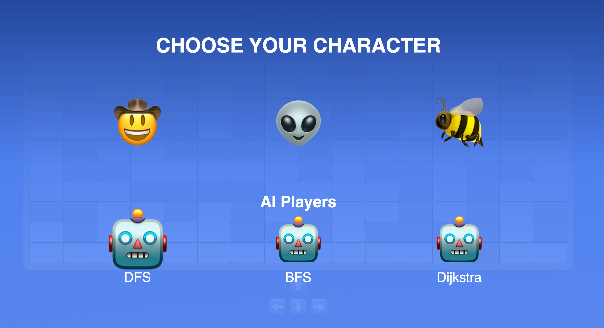
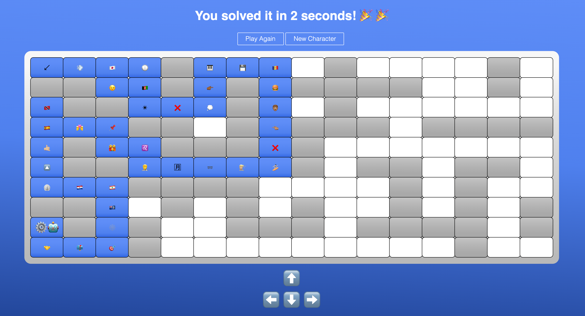
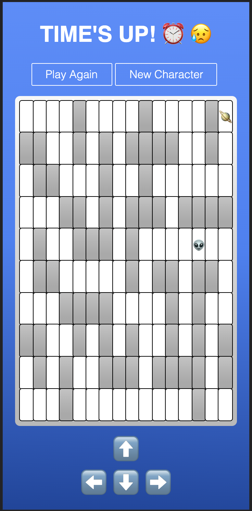

# Emoji Maze

---

## Description

Solve the maze before the time runs out! Choose from a variety of characters, including one (for now) AI character that will solve the maze algorithmically. Right now, the maze is represented by an unweighted, undirected graph and implements Deapth First Search to find the goal.

## Screenshots

_Character Menu:_

_DFS Path / Win Message:_

 

_Mobile UI / Loss Message:_

## Technologies Used
- JavaScript
- JQuery
- HTML/CSS

## Getting Started

 - ### [GAME LINK](https://turpen2319.github.io/emoji-maze/)

 - use arrow keys / tap arrow icons to move

## Next Steps
- Create multiple paths to the goal and incorporate 'slow zones' that take more time to pass through
- Represent maze as weighted, undirected graph (weights will corelate with slow zones penalty)
- Implement Dijkstra's algorithm
- Explore other path-finding algorithms 

